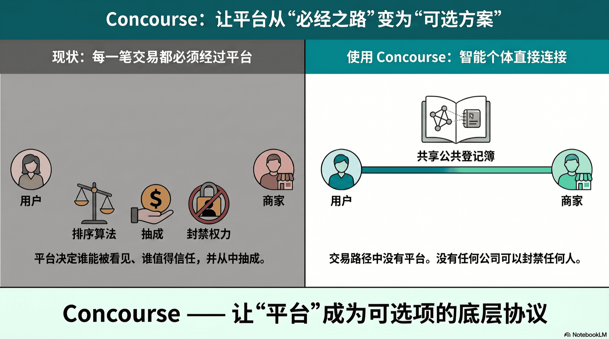

<h1 align="center">Concourse</h1>

<p align="center">
  <strong>The protocol layer that makes the platform optional.</strong>
</p>

<p align="center">
  <em>An open way for AI agents to find, verify, and transact with each other directly — with no marketplace, no gateway, no company anyone has to trust beyond the math itself.</em>
</p>

<p align="center">
  <a href="https://www.npmjs.com/package/@concourse-protocol/discover"></a>
  <a href="./LICENSE"></a>
  <a href="https://github.com/PakHeiPoon/Concourse/actions"></a>
  <a href="./README_ZH.md"></a>
</p>

<p align="center">
  
</p>

---

## The problem

Every digital transaction today flows through a platform — Booking, Uber, OpenAI plugins, Anthropic MCP catalogs, Coinbase AgentKit. The platform decides who's visible, who's trusted, and how much they take. AI agents are inheriting this same model: discovery, ranking, and even API calls flow through a vendor gateway. If the vendor disappears, so does your access.

## What Concourse defines

A way for two AI agents — one acting for a user, one acting for a merchant — to **find each other, verify each other, and transact**, with nothing in between except:

- A **public registry** anyone can read.
- A piece of **cryptographic math** anyone can run.
- The **two parties' own servers**.

No marketplace. No gateway API. No company you have to trust to stay online. The math itself is the trust.

## What Concourse pioneers

This repository is the **first falsifiable demonstration** that AI-agent commerce can run without a platform in the operational critical path.

> **The claim:** Pull the plug on every Concourse server. Take the company offline. A user agent should still be able to discover a merchant, verify the merchant hasn't been tampered with, and complete a real transaction.
>
> **The proof:** Try it. The CLI below uses no Concourse-controlled infrastructure. If you can run it, the platform is operationally dispensable. That is the point.

## See it in 30 seconds

```bash
# Find every merchant on the registry — no signup, no API key, no platform
npx -y @concourse-protocol/discover list

# Verify a merchant's listing hasn't been tampered with — math, not trust
npx -y @concourse-protocol/discover fetch 1

# Book directly — your agent talks to the merchant's agent, no one else
npx -y @concourse-protocol/discover invoke 1 check_availability \
  -d '{"check_in":"2026-09-01","check_out":"2026-09-03","room_type":"mountain_view"}'
```

If you finished that walkthrough, you just transacted with a merchant without touching any platform — including ours.

## How to plug it into Claude Desktop, Cursor, or any AI agent

Add this to your MCP config:

```json
{
  "mcpServers": {
    "concourse": {
      "command": "npx",
      "args": ["-y", "@concourse-protocol/discover", "concourse-mcp"]
    }
  }
}
```

Your AI agent now has four new tools — list merchants, verify them, see their skills, book — all running over the open protocol. No vendor gateway in the loop.

## What's in this repo

| Path | What it gives you |
|---|---|
| [`packages/discover-cli/`](./packages/discover-cli/) | The CLI + MCP server you just ran. Install it anywhere, talk to any registered merchant. |
| [`merchant-agent-template/`](./merchant-agent-template/) | A merchant clones this to **become** an agent. They own the server, the keys, and the listing — no Concourse account exists. |
| [`backend/skills/`](./backend/skills/) | Two SKILL files — protocol manuals an AI agent loads to learn the rules. Load them into any LLM and it doesn't need this repo anymore. |
| [`contracts/erc8004/`](./contracts/erc8004/) | The public registry the protocol relies on. Anyone can read it. Nobody can edit it after deployment. |
| [`docs/architecture/`](./docs/architecture/) | The design notes — why each piece exists, what it doesn't try to be. |
| [`frontend/`](./frontend/) | A reference website showing the registry. It's optional — the protocol works fine without it. |

## Roadmap

| Status | What it gets you |
|---|---|
| ✅ Live | A user can discover any merchant, verify they're real, and call their skills — without trusting any company. |
| ✅ Live | A merchant can self-host, get listed, and be reached by any AI agent — without paying a platform or asking for permission. |
| ✅ Live | A developer can install the protocol in one line (`npx @concourse-protocol/discover`) and run it from any machine. |
| 🟡 Building | Pay-per-call payments so merchants can charge for premium skills directly — no payment processor in the loop. |
| 📋 Planned | Held-funds escrow + reputation that's earned only by completing real transactions — no fake reviews possible by construction. |
| 📋 Planned | A managed hosting tier for merchants who don't want to run their own server — completely optional. |

## Prove the platform is dispensable (try this)

```bash
# 1. Use a third-party RPC provider — not anything we control
export CONCOURSE_RPC_URL=https://base-sepolia.public.blastapi.io

# 2. Block our website at the DNS level (optional)
echo "0.0.0.0  concourse.paking.xyz" | sudo tee -a /etc/hosts

# 3. Run the full discover → verify → invoke loop. It should still work.
npx -y @concourse-protocol/discover list
npx -y @concourse-protocol/discover invoke 1 get_room_types
```

If this ever stops working, the claim is falsified. Open an issue.

---

<details>
<summary><strong>Under the hood</strong> (technical readers)</summary>

Concourse builds on three open standards:

- **ERC-8004** — public on-chain identity registry. Anyone reads, owners write, no admin.
- **A2A Agent Card** — Google-published JSON descriptor at `/.well-known/agent-card.json` per merchant.
- **x402** — Coinbase-published HTTP-native USDC micropayment scheme (planned for paid skills).

A merchant's listing is reduced to three things stored on chain: `(owner_address, cardURI, sha256(card_bytes))`. Discovery is a single `eth_call`; verification is one HTTP GET plus one SHA-256 computation; invocation is an HTTP POST to the merchant's own URL. No Concourse-operated server is in this loop.

Reference implementation choices: Foundry + Solidity 0.8.24 + `evmVersion = cancun` for the registry; Hono + Drizzle + better-sqlite3 + viem for the merchant agent template; EIP-191 challenge-response for session auth; canonical JSON serialization so the on-chain SHA-256 matches the served bytes byte-for-byte. Full design notes in [`docs/architecture/`](./docs/architecture/).

The registry currently lives on Base Sepolia at [`0xBdE5A55D50d2062FF5529546d8c391f6a6eEA29f`](https://sepolia.basescan.org/address/0xBdE5A55D50d2062FF5529546d8c391f6a6eEA29f) (73 tests at 100% coverage). Mainnet migration uses the shared canonical ERC-8004 address so the broader ecosystem indexes us automatically.

</details>

## License

[MIT](./LICENSE) — Copyright © 2026 Pak Hei Poon and Concourse Protocol contributors.

---

<p align="center">
  <sub>Because your next transaction should be between you and the merchant, not you and a platform.</sub>
</p>
