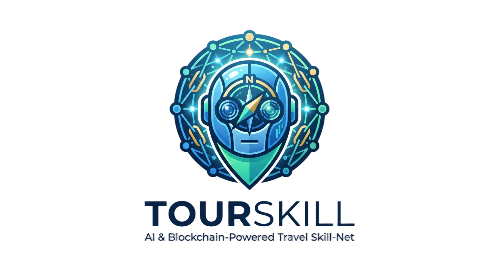

<p align="center">
  
</p>

<p align="center">
  
</p>

<p align="center">
  <strong>Concourse —— AI agent 之间直接发现、验证、交易的开放协议层。Agent-to-Agent · Peer-to-Peer。</strong>
</p>

<p align="center">
  <em>基于 ERC-8004 Trustless Agents · A2A Agent Card · x402 微支付。旅游是验证协议的第一个垂类——任何商业类型都能跑在这套协议上。</em>
</p>

<p align="center">
  <a href="./README.md"></a>
  <a href="#快速开始"></a>
  <a href="LICENSE"></a>
</p>

<p align="center">
  
  
  
</p>

---

## 目录

- [问题：为什么需要 Concourse？](#问题为什么需要-concourse)
- [愿景：智能体直接对话](#愿景智能体直接对话)
- [工作流程](#工作流程)
- [系统架构](#系统架构)
- [核心特性](#核心特性)
- [快速开始](#快速开始)
- [项目结构](#项目结构)
- [技术栈](#技术栈)
- [路线图](#路线图)
- [Star History](#star-history)

---

## 问题：为什么需要 Concourse？

### 现状：你的旅行体验被平台控制

<p align="center">
  
</p>
**选择的幻觉：** 商家看似有定价权，但平台通过发现机制、排名算法和优惠券生态系统掌控一切。酒店 ¥800 的房间在平台上变成 ¥1,200 —— 然后一张"¥200 优惠券"让你觉得 ¥1,000 买到了便宜。实际上商家只拿到 ¥900。

> *"我们发明了互联网来直接连接人与人。然后我们又建了平台，坐在每个连接中间收租。"*

---

## 愿景：智能体直接对话

受 **比特币白皮书核心思想** 启发 —— *无需可信第三方的点对点交易* —— Concourse 将同样的原则应用到旅游商业：

<p align="center">
  
</p>

### 进化之路：从平台依赖到智能体自由

<p align="center">
  
</p>


---

## 工作流程

### 用户使用流程

<p align="center">
  
</p>

---

## 系统架构

<p align="center">
  
</p>

<details>
<summary>文字版本（点击展开）</summary>

```
                           ┌─────────────────────────────────┐
                           │        前端 (React)              │
                           │                                  │
                           │  ┌────────┐ ┌──────┐ ┌───────┐ │
                           │  │商家注册│ │商家   │ │AI 智能│ │
                           │  │Portal  │ │浏览器 │ │体演示 │ │
                           │  └───┬────┘ └──┬───┘ └───┬───┘ │
                           └──────┼─────────┼─────────┼──────┘
                                  │         │         │
                    ┌─────────────┘         │         └──────────────┐
                    │                       │                        │
                    ▼                       ▼                        ▼
          ┌──────────────────┐    ┌────────────────────┐   ┌───────────────────┐
          │  ERC-8004 层      │    │  商家 Agent         │   │ 可选 LLM          │
          │  (Base Sepolia)   │    │  (Hono · 自托管)   │   │ (任何 OpenAI       │
          │                   │    │                    │   │  兼容端点)        │
          │  IdentityRegistry │    │  /.well-known/     │   │                   │
          │  ReputationReg    │    │    agent-card.json │   │ - 七牛云 MaaS     │
          │  ValidationReg    │    │  /auth/challenge   │   │ - OpenAI          │
          │                   │    │  /auth/verify      │   │ - 0G Compute      │
          │  每个 agent：      │    │  /skills/<name>    │   │ - DeepSeek / Kimi │
          │  - 所有者钱包      │    │                    │   │                   │
          │  - 卡片 URI       │    │  EIP-191 认证      │   │ user-agent 用     │
          │  - SHA-256 hash   │    │  Idempotency-Key   │   │ 来做 tool-calling │
          │                   │    │  保护状态变更      │   │ 循环。            │
          └──────────────────┘    └────────────────────┘   └───────────────────┘
```

</details>

### 商家技能系统

Concourse 的商家发布的是**可执行技能** —— 不是静态列表。任何 AI 智能体都可以调用：

| 类别 | 技能 | 说明 |
|------|------|------|
| **餐厅** | `get_menu`, `reserve_table`, `check_table_availability`, `get_dietary_options` | 真实菜单含价格、饮食标签、过敏原 |
| **酒店** | `check_availability`, `get_rates`, `create_booking`, `get_cancellation_policy` | 房型、动态定价、取消规则 |
| **景点** | `check_ticket_inventory`, `get_opening_hours`, `purchase_ticket`, `get_visitor_guide` | 时段、联票、交通指南 |

---

## 核心特性

| 特性 | 说明 |
|------|------|
| **去中心化注册表** | 链上商家身份，Profile Hash 验证 |
| **MCP 协议** | 标准工具接口 —— 任何 AI 智能体都能接入 |
| **用户驱动 AI** | 你的钱包支付 LLM 推理费用 —— 无中心化 API Key |
| **网络切换** | 支持测试网 / 主网，自动配置链参数 |
| **智能充值** | 自动检测余额，仅在不足时充值/转账 |
| **12 种商家技能** | 真实可执行 API：菜单、预订、门票、指南 |
| **自主智能体** | LLM 自主决定调用哪些工具（最多 8 轮） |
| **实时日志** | 终端面板实时展示每个工具调用和结果 |
| **多城市数据** | 杭州、上海、苏州、北京 —— 29 家真实商家 |

---

## 快速开始

### 前置要求

- Node.js 18+ / Python 3.10+
- MetaMask 浏览器插件
- 测试网代币（[水龙头](https://faucet.0g.ai)）

### 1. 克隆仓库

```bash
git clone https://github.com/PakHeiPoon/Concourse.git
cd Concourse
```

### 2. 启动后端（MCP 网关）

```bash
cd backend
python -m venv venv && source venv/bin/activate
pip install -r requirements.txt
cp .env.example .env    # 编辑填入 Supabase 凭证
uvicorn app.main:app --reload --port 8000
```

### 3. 启动前端

```bash
cd frontend
npm install
npm run dev
```

### 4. 部署智能合约（可选 —— 已部署）

```bash
cd contracts
npm install
cp .env.example .env    # 编辑填入部署私钥
npx hardhat run scripts/deploy.js --network zerog_testnet
```

> **已部署合约：** [`0x18B9AbB94eeaCbAbc6bFECB7143165AF6E0df543`](https://chainscan-galileo.0g.ai/address/0x18B9AbB94eeaCbAbc6bFECB7143165AF6E0df543) （0G 测试网，chainId `16602`）—— 已注册 28 家覆盖杭州、上海、苏州、北京的真实商家。

---

## 通过 SKILL.md 接入个人 Agent

Concourse 提供一份**客户端 SKILL.md 规范**——任何 AI agent（Claude Code、Cursor、自定义 agent）都可以装载这套技能，发现并交互链上商家注册表。

### 一键安装

让你的个人 agent 装载：

> "从 `https://api.tourskill.paking.xyz/skills/user-client/SKILL.md` 安装 Concourse 技能"

SKILL.md 由 Concourse 公共网关直接托管——和它描述的 API 同一个域名。不依赖 GitHub 访问。

装上之后 agent 会：

1. **意图分类**：把"明天在杭州吃饭"抽成结构化字段
2. **链上发现**：调注册表查相关商家——已部署在 0G 测试网
3. **个性化重排序**：用你的偏好（过敏原、预算、历史）做二次排序——**这是反 OTA 算法的核心抓手**
4. **调用商家技能**：订餐 / 订房 / 买票，全程带链上凭证

完整规范见 [`skills/user-client/SKILL.md`](skills/user-client/SKILL.md)。

---

## 项目结构

```
Concourse/
├── frontend/                    # React + Vite + Tailwind
│   ├── src/pages/
│   │   ├── RegistrationPortal.tsx    # 商家注册
│   │   ├── Explorer.tsx              # 浏览 & 测试商家技能
│   │   └── AgentDemo.tsx             # AI 智能体聊天界面
│   ├── src/hooks/
│   │   └── use0gCompute.ts           # 去中心化 LLM Hook
│   └── src/contracts/
│       └── MerchantRegistry.ts       # 链上合约 ABI
├── backend/                     # FastAPI MCP 网关
│   ├── app/routers/mcp.py           # MCP 工具端点
│   ├── app/services/
│   │   ├── merchant_service.py       # 发现 & 查询
│   │   └── skill_service.py          # 12 个技能处理器
│   └── requirements.txt
├── contracts/                   # Solidity (Hardhat 3)
│   ├── contracts/MerchantRegistry.sol
│   └── scripts/deploy.js
├── agent/                       # 可选的服务端智能体
│   └── server.js
└── skills/                      # 客户端 SKILL.md 规范（给个人 agent 装载）
    └── user-client/SKILL.md         # 发现 → 个性化 → 调用 闭环
```

---

## 技术栈

| 层级 | 技术 |
|------|------|
| 前端 | React 19 + TypeScript + Vite + Tailwind v4 + ethers v6 |
| 区块链 | **Base Sepolia**（测试网，已上线）→ **Base 主网**（标准 ERC-8004 共享注册表）|
| 智能合约 | Solidity 0.8.24 + Foundry — evmVersion `cancun`，optimizer 200，73 测试 100% 覆盖 |
| 商家 agent 模板 | Hono 4 + Drizzle + better-sqlite3 + viem + Zod + vitest |
| 认证 | EIP-191 challenge → 不透明 bearer token（未来 booking-escrow 走 EIP-712）|
| 标准 | **ERC-8004**（Trustless Agents）+ **A2A**（Agent Card）+ **x402**（付费 skill，规划中）|
| 托管 | 自托管（Fly.io / Railway / 自有 VPS）· 前端 Vercel · 平台多租户 SaaS 规划中 |
| 可选 LLM | 任何 OpenAI 兼容端点（七牛云 MaaS、OpenAI、0G Compute、DeepSeek、Kimi…）|
| 钱包 | MetaMask / 硬件钱包（ethers v6 / viem）|

---

## 路线图

协议上第一个真 agent —— `wumingchu.tourskill.paking.xyz` —— **已上线**，Base Sepolia 上 agentId=1。
任何客户端均可验证：`cast call --rpc-url https://sepolia.base.org 0xBdE5A55D50d2062FF5529546d8c391f6a6eEA29f 'getAgent(uint256)' 1`

| 阶段 | 状态 | 说明 |
|---|---|---|
| **Phase A.2 — 合约** | ✅ 已上线 | `IdentityRegistry`、`ReputationRegistry`、`ValidationRegistry` 三合约在 Base Sepolia 部署 + Basescan verified |
| **Phase A.3 — 商家模板** | ✅ 已上线 | 开源 Hono 模板、5 个酒店 skill、EIP-191 认证、canonical-JSON 卡片 + SHA-256 header |
| **Phase A.5 — 首个 live agent** | ✅ 已上线 | 无名处·黄山 部署在 Fly Tokyo，自有域名 + LetsEncrypt 证书，链上 agentId=1 |
| **Phase A.7 — Trustless explorer** | ✅ 已上线 | 前端直连 IdentityRegistry，浏览器算 SHA-256 验证 card 字节，直连 agent URL 调 skill |
| **Phase B-min — 主网共享注册表** | 🟡 进行中 | 部署脚本切换到标准 ERC-8004 主网地址（`0x8004A169…A432`），让 [8004scan.io](https://8004scan.io) 自动索引 |
| **Phase B-mcp — MCP 接口** | 🟡 进行中 | 在 merchant-agent 上新增 MCP server 路由，Claude Desktop / GPT 可把商家当原生 tool 使用 |
| **Phase C-1 — 前端全面切换 Base** | 🟡 进行中 | 下线老 0G 演示数据，MerchantSign 改走 Base IdentityRegistry（MetaMask 签名）|
| **Phase C-2 — x402 付费 skill** | 📋 规划中 | 无状态 per-call USDC 微支付（EIP-3009），标准 Coinbase x402 用法，不和 booking escrow 混杂 |
| **Phase C-3 — `@concourse/cli`** | 📋 规划中 | 独立 npm CLI：`concourse list`、`concourse show 1`、`concourse call <id> <skill>` |
| **Phase D — BookingEscrow + 信誉** | 📋 规划中 | EIP-712 Seaport 风格 escrow，时间锁释放；结算后自动给买家 ReputationRegistry 留评授权 |
| **Phase E — 平台多租户 SaaS** | 📋 规划中 | 平台托管运行时，95% 中小商家走零运维 SaaS，分免费/付费 tier |

详见 [`docs/architecture/07_MIGRATION_PLAN.md`](./docs/architecture/07_MIGRATION_PLAN.md)（Phase A 收尾 + 后续路线）和 [`merchant-agent-template/TROUBLESHOOTING.md`](./merchant-agent-template/TROUBLESHOOTING.md)（上线 agent #1 时踩过的坑）。

---

## Star History

<div align="center">
  <a href="https://star-history.com/#PakHeiPoon/Concourse&Date">
    <picture>
      <source media="(prefers-color-scheme: dark)" srcset="https://api.star-history.com/svg?repos=PakHeiPoon/Concourse&type=Date&theme=dark" />
      <source media="(prefers-color-scheme: light)" srcset="https://api.star-history.com/svg?repos=PakHeiPoon/Concourse&type=Date" />
      
    </picture>
  </a>
</div>

---

## 许可证

MIT

---

<p align="center">
  <sub>Concourse —— 因为你的下一趟旅行，应该是你和商家之间的事，不是你和平台之间的事。</sub>
</p>
