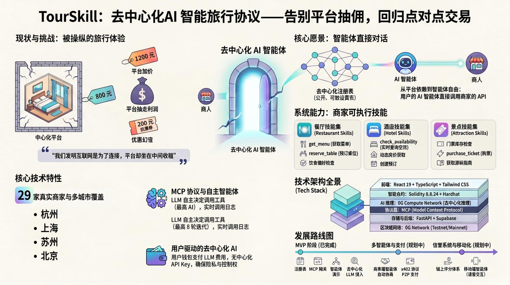

<p align="center">
  
</p>

<p align="center">
  <strong>打破 OTA 垄断 —— 智能体对智能体的旅游新范式</strong>
</p>

<p align="center">
  <a href="./README.md"></a>
  <a href="#-快速开始"></a>
  <a href="LICENSE"></a>
</p>

<p align="center">
  
  
  
</p>

---

## 目录

- [问题：为什么需要 TourSkill？](#-问题为什么需要-tourskill)
- [愿景：智能体直接对话](#-愿景智能体直接对话)
- [工作流程](#-工作流程)
- [系统架构](#-系统架构)
- [核心特性](#-核心特性)
- [快速开始](#-快速开始)
- [项目结构](#-项目结构)
- [技术栈](#-技术栈)
- [路线图](#-路线图)
- [Star History](#-star-history)

---

## 问题：为什么需要 TourSkill？

### 现状：你的旅行体验被平台控制

```
    你（旅行者）                              商家（酒店/餐厅）
         |                                          |
         |   "我想在杭州找一家                        |
         |    湖景酒店，预算800/晚"                    |
         |                                          |
         ▼                                          |
  ┌─────────────────────────────────┐               |
  │                                 │               |
  │      OTA 平台                    │               |
  │     （携程 / 美团 / Booking）     │               |
  │                                 │               |
  │   - 控制你能看到什么              │               |
  │   - 按佣金排名，不是按质量        │               |
  │   - 隐藏直接价格                 │               |
  │   - 抽取 15-25% 佣金            │               |
  │   - 拥有你的数据                 │               |
  │   - "优惠券" = 价格操控          │               |
  │                                 │               |
  └────────────────┬────────────────┘               |
                   |                                |
                   ▼                                |
            你看到 ¥1,200                     商家收到 ¥900
           （平台加价后）                     （扣除佣金后）
```

**选择的幻觉：** 商家看似有定价权，但平台通过发现机制、排名算法和优惠券生态系统掌控一切。酒店 ¥800 的房间在平台上变成 ¥1,200 —— 然后一张"¥200 优惠券"让你觉得 ¥1,000 买到了便宜。实际上商家只拿到 ¥900。

> *"我们发明了互联网来直接连接人与人。然后我们又建了平台，坐在每个连接中间收租。"*

---

## 愿景：智能体直接对话

受 **比特币白皮书核心思想** 启发 —— *无需可信第三方的点对点交易* —— TourSkill 将同样的原则应用到旅游商业：

```
  ┌─────────────────┐                    ┌─────────────────┐
  │                 │                    │                 │
  │  你的个人        │   智能体直接通信    │   商家           │
  │  AI 智能体      │◄──────────────────►│   AI 智能体      │
  │                 │                    │                 │
  │  - 你的钱包     │   ┌──────────┐    │  - 他们的技能    │
  │  - 你的偏好     │   │TourSkill │    │  - 他们的价格    │
  │  - 你的预算     │   │注册表     │    │  - 他们的规则    │
  │                 │   │(链上)    │    │                 │
  │  理解你说：     │──►│          │◄───│  发布：         │
  │  "我肚子疼，    │   │ 发现     │    │  - 真实菜单     │
  │   想吃清淡的，  │   │ 验证     │    │  - 真实价格     │
  │   还带着狗"     │   │ 连接     │    │  - 实时可用性   │
  │                 │   └──────────┘    │  - 直接定价     │
  └─────────────────┘                    │   （无加价）    │
          |                              └─────────────────┘
          └───────────────┬───────────────────────┘
                          |
                          ▼
                   ┌──────────────┐
                   │   点对点支付   │
                   │  （未来：x402）│
                   └──────────────┘

              没有佣金。没有加价。
              没有数据窃取。没有排名操控。
              只有智能体服务人类。
```

### 进化之路：从平台依赖到智能体自由

```
  过去                     现在                     未来
  ━━━━                     ━━━━                     ━━━━

  电话簿                   OTA 平台                  TourSkill
  （黄页）                （携程、美团）             （智能体黄页）
       │                       │                         │
  人工翻阅                 人工浏览                   智能体发现
  电话号码                 平台推荐列表               已验证商家
       │                       │                         │
  人工打电话               人工点击                   智能体调用
  联系商家                 "立即预订"                 商家技能 API
       │                       │                         │
  直接谈价                 支付平台                   智能体直接
  格                       加价后价格                 与商家协商
       │                       │                         │
  直接付款                 平台抽成                   点对点支付
  给商家                   15-25%                     (x402)
       │                       │                         │
  ✓ 直接                   ✗ 被中间商                  ✓ 直接
  ✗ 不可规模化             ✓ 可规模化                  ✓ 可规模化
  ✗ 没有 AI               ✗ 平台锁定                  ✓ AI 原生
                           ✗ 数据被利用                ✓ 用户掌控数据
```

---

## 工作流程

### 用户使用流程

```
  ┌─────────────────────────────────────────────────────────────────┐
  │                                                                 │
  │  第一步：连接钱包                                                │
  │  ┌──────────────┐                                              │
  │  │   MetaMask    │──► 选择网络（测试网 / 主网）                  │
  │  │   🦊          │──► 自动创建计算账本（如需要）                 │
  │  └──────────────┘──► 智能余额检测 & 自动充值                    │
  │                                                                 │
  │  第二步：自然语言提问                                            │
  │  ┌──────────────────────────────────────────────────────┐      │
  │  │ "我今晚肚子有点痛，去杭州玩还带着我的狗，              │      │
  │  │  有什么推荐吃的么？"                                   │      │
  │  └──────────────────────────────────┬───────────────────┘      │
  │                                     │                           │
  │  第三步：智能体自主行动              ▼                           │
  │  ┌─────────────────────────────────────────────────────┐       │
  │  │  LLM 思考 → 调用 discover_merchants(杭州, 餐厅)    │       │
  │  │  → 发现 4 家餐厅 → 对每家调用 get_menu()           │       │
  │  │  → 过滤清淡/不辣的菜品 → 检查宠物友好选项           │       │
  │  │  → 调用 check_table_availability() → 呈现结果      │       │
  │  └─────────────────────────────────────────────────────┘       │
  │                                                                 │
  │  第四步：获得真实结果                                            │
  │  ┌──────────────────────────────────────────────────────┐      │
  │  │  "我找到了 3 家西湖附近可以带宠物的餐厅：             │      │
  │  │   1. 外婆家 — 清蒸豆腐汤 ¥28，口味清淡              │      │
  │  │   2. 绿茶餐厅 — 养胃粥套餐 ¥35                      │      │
  │  │   需要我帮你预订座位吗？"                             │      │
  │  └──────────────────────────────────────────────────────┘      │
  │                                                                 │
  └─────────────────────────────────────────────────────────────────┘

  全程由你的钱包驱动。你的代币付费。无需 API Key。无需平台。
```

---

## 系统架构

<p align="center">
  
</p>

<details>
<summary>文字版本（点击展开）</summary>

```
                           ┌─────────────────────────────────┐
                           │        前端 (React)              │
                           │                                  │
                           │  ┌────────┐ ┌──────┐ ┌───────┐ │
                           │  │商家注册│ │商家   │ │AI 智能│ │
                           │  │Portal  │ │浏览器 │ │体演示 │ │
                           │  └───┬────┘ └──┬───┘ └───┬───┘ │
                           └──────┼─────────┼─────────┼──────┘
                                  │         │         │
                    ┌─────────────┘         │         └──────────────┐
                    │                       │                        │
                    ▼                       ▼                        ▼
          ┌─────────────────┐    ┌──────────────────┐   ┌───────────────────┐
          │  智能合约         │    │  MCP 网关          │   │ 去中心化 LLM      │
          │  (链上)          │    │  (FastAPI)         │   │ (0G Compute)      │
          │                  │    │                    │   │                   │
          │  MerchantRegistry│    │  3 个 MCP 工具：   │   │ 支持模型：         │
          │  .sol            │    │  - 发现商家        │   │ - Qwen            │
          │                  │    │  - 调用技能        │   │ - GLM             │
          │  链上存储：       │    │  - 查询详情        │   │ - DeepSeek        │
          │  - DID           │    │                    │   │                   │
          │  - Profile Hash  │    │  12 个技能处理器   │   │ 工具调用循环       │
          │  - 技能端点      │    │  (菜单/预订/门票)  │   │ (最多 8 轮)       │
          └─────────────────┘    │                    │   │                   │
                                  │  ┌──────────────┐ │   │ processResponse() │
                                  │  │  Supabase DB │ │   │ 费用结算          │
                                  │  └──────────────┘ │   │                   │
                                  └──────────────────┘   └───────────────────┘
```

</details>

### 商家技能系统

TourSkill 的商家发布的是**可执行技能** —— 不是静态列表。任何 AI 智能体都可以调用：

| 类别 | 技能 | 说明 |
|------|------|------|
| **餐厅** | `get_menu`, `reserve_table`, `check_table_availability`, `get_dietary_options` | 真实菜单含价格、饮食标签、过敏原 |
| **酒店** | `check_availability`, `get_rates`, `create_booking`, `get_cancellation_policy` | 房型、动态定价、取消规则 |
| **景点** | `check_ticket_inventory`, `get_opening_hours`, `purchase_ticket`, `get_visitor_guide` | 时段、联票、交通指南 |

---

## 核心特性

| 特性 | 说明 |
|------|------|
| **去中心化注册表** | 链上商家身份，Profile Hash 验证 |
| **MCP 协议** | 标准工具接口 —— 任何 AI 智能体都能接入 |
| **用户驱动 AI** | 你的钱包支付 LLM 推理费用 —— 无中心化 API Key |
| **网络切换** | 支持测试网 / 主网，自动配置链参数 |
| **智能充值** | 自动检测余额，仅在不足时充值/转账 |
| **12 种商家技能** | 真实可执行 API：菜单、预订、门票、指南 |
| **自主智能体** | LLM 自主决定调用哪些工具（最多 8 轮） |
| **实时日志** | 终端面板实时展示每个工具调用和结果 |
| **多城市数据** | 杭州、上海、苏州、北京 —— 29 家真实商家 |

---

## 快速开始

### 前置要求

- Node.js 18+ / Python 3.10+
- MetaMask 浏览器插件
- 测试网代币（[水龙头](https://faucet.0g.ai)）

### 1. 克隆仓库

```bash
git clone https://github.com/PakHeiPoon/TourSkill.git
cd TourSkill
```

### 2. 启动后端（MCP 网关）

```bash
cd backend
python -m venv venv && source venv/bin/activate
pip install -r requirements.txt
cp .env.example .env    # 编辑填入 Supabase 凭证
uvicorn app.main:app --reload --port 8000
```

### 3. 启动前端

```bash
cd frontend
npm install
npm run dev
```

### 4. 部署智能合约（可选 —— 已部署）

```bash
cd contracts
npm install
cp .env.example .env    # 编辑填入部署私钥
npx hardhat run scripts/deploy.js --network zerog_testnet
```

> **已部署合约：** [`0x18B9AbB94eeaCbAbc6bFECB7143165AF6E0df543`](https://chainscan-galileo.0g.ai/address/0x18B9AbB94eeaCbAbc6bFECB7143165AF6E0df543)

---

## 项目结构

```
TourSkill/
├── frontend/                    # React + Vite + Tailwind
│   ├── src/pages/
│   │   ├── RegistrationPortal.tsx    # 商家注册
│   │   ├── Explorer.tsx              # 浏览 & 测试商家技能
│   │   └── AgentDemo.tsx             # AI 智能体聊天界面
│   ├── src/hooks/
│   │   └── use0gCompute.ts           # 去中心化 LLM Hook
│   └── src/contracts/
│       └── MerchantRegistry.ts       # 链上合约 ABI
├── backend/                     # FastAPI MCP 网关
│   ├── app/routers/mcp.py           # MCP 工具端点
│   ├── app/services/
│   │   ├── merchant_service.py       # 发现 & 查询
│   │   └── skill_service.py          # 12 个技能处理器
│   └── requirements.txt
├── contracts/                   # Solidity (Hardhat 3)
│   ├── contracts/MerchantRegistry.sol
│   └── scripts/deploy.js
└── agent/                       # 可选的服务端智能体
    └── server.js
```

---

## 技术栈

| 层级 | 技术 |
|------|------|
| 前端 | React 19 + TypeScript + Vite + Tailwind CSS |
| 智能合约 | Solidity 0.8.24 + Hardhat 3 |
| 后端 | FastAPI + Supabase |
| AI 推理 | 0G Compute Network + `@0glabs/0g-serving-broker` |
| 协议 | MCP（模型上下文协议） |
| 钱包 | MetaMask + ethers.js v6 |
| 区块链 | 0G Network（测试网 & 主网） |

---

## 路线图

| 阶段 | 状态 | 说明 |
|------|------|------|
| **MVP** | 已完成 | 注册表 + MCP 网关 + 智能体演示 + 去中心化 LLM |
| **多智能体** | 规划中 | 商家端智能体与用户智能体直接协商 |
| **x402 支付** | 规划中 | HTTP 原生的智能体间点对点支付 |
| **信誉系统** | 规划中 | 链上评价和信任评分 |
| **多链部署** | 规划中 | 在多条链上部署注册表 |
| **移动端** | 规划中 | 支持语音交互的移动智能体 |

---

## Star History

<div align="center">
  <a href="https://star-history.com/#PakHeiPoon/TourSkill&Date">
    <picture>
      <source media="(prefers-color-scheme: dark)" srcset="https://api.star-history.com/svg?repos=PakHeiPoon/TourSkill&type=Date&theme=dark" />
      <source media="(prefers-color-scheme: light)" srcset="https://api.star-history.com/svg?repos=PakHeiPoon/TourSkill&type=Date" />
      
    </picture>
  </a>
</div>

---

## 许可证

MIT

---

<p align="center">
  <sub>TourSkill —— 因为你的下一趟旅行，应该是你和商家之间的事，不是你和平台之间的事。</sub>
</p>
